# Database Design Documentation - Allertify Backend

## Overview
Database design untuk aplikasi Allertify yang fokus pada manajemen alergi makanan dan scanning produk. Database menggunakan PostgreSQL dengan Prisma ORM.

## Entity-Relationship Diagram (ERD)

```mermaid
erDiagram
    user ||--o{ emergency_contact : "has one"
    user ||--o{ subscription : "has many"
    user ||--o{ user_allergen : "has many"
    user ||--o{ product_report : "reports many"
    user ||--o{ product_scan : "scans many"
    user ||--o{ daily_scan_usage : "tracks daily"
    user ||--o{ email_verification : "verifies"
    user ||--o{ user_product_preference : "preferences"
    user ||--o{ password_reset : "resets"

    allergen ||--o{ user_allergen : "assigned to users"
    
    tier_plan ||--o{ subscription : "defines plans"
    
    product ||--o{ product_scan : "scanned by users"
    product ||--o{ product_report : "reported by users"
    product ||--o{ user_product_preference : "user preferences"

    user {
        int id PK
        string full_name
        string email UK
        string password
        string phone_number
        boolean is_verified
        int role
        string profile_picture_url
        datetime createdAt
        datetime updatedAt
        datetime last_login
    }

    allergen {
        int id PK
        string name UK
        string description
        boolean is_custom
    }

    tier_plan {
        int id PK
        string plan_type UK
        int scan_count_limit
        int saved_product_limit
    }

    product {
        int id PK
        string barcode UK
        string name
        string image_url
        string nutritional_score
        string ingredients
        datetime updatedAt
    }

    emergency_contact {
        int id PK
        int user_id FK,UK
        string name
        string phone_number
        string relationship
        datetime createdAt
        datetime updatedAt
    }

    subscription {
        int id PK
        int user_id FK
        int tier_plan_id FK
        datetime start_date
        datetime end_date
        string status
    }

    user_allergen {
        int id PK
        int user_id FK
        int allergen_id FK
        string security_level
    }

    product_report {
        int id PK
        int user_id FK
        int product_id FK
        string report_details
        string status
        datetime createdAt
    }

    product_scan {
        int id PK
        int user_id FK
        int product_id FK
        datetime scan_date
        string risk_level
        string risk_explanation
        string matched_allergens
        boolean is_saved
    }

    user_product_preference {
        int id PK
        int user_id FK
        int product_id FK
        string list_type
        datetime createdAt
        datetime updatedAt
    }

    daily_scan_usage {
        int id PK
        int user_id FK
        datetime usage_date
        int scan_count
    }

    email_verification {
        int id PK
        int user_id FK
        string otp_code
        datetime otp_code_expired
        datetime usedAt
        datetime createdAt
    }

    password_reset {
        int id PK
        int user_id FK
        string token UK
        datetime expires_at
        datetime createdAt
    }
```



## Table Descriptions & Purposes

### Core User Management
| Table | Purpose | Key Features |
|-------|---------|--------------|
| **user** | Central user management | Authentication, profile data, role-based access |
| **email_verification** | Email verification system | OTP-based verification with expiration |
| **password_reset** | Password recovery | Secure token-based reset with expiration |

### Allergy Management
| Table | Purpose | Key Features |
|-------|---------|--------------|
| **allergen** | Master allergen catalog | Standard + custom allergens |
| **user_allergen** | User-specific allergen mapping | Security level classification |
| **user_product_preference** | Personal product lists | RED/GREEN list management |

### Subscription & Billing
| Table | Purpose | Key Features |
|-------|---------|--------------|
| **tier_plan** | Subscription plan definitions | Scan limits, storage limits |
| **subscription** | User subscription tracking | Plan status, validity periods |

### Product Management
| Table | Purpose | Key Features |
|-------|---------|--------------|
| **product** | Product catalog | Barcode, ingredients, nutritional info |
| **product_scan** | Scan history & results | Risk assessment, allergen matching |
| **product_report** | User product reports | Issue reporting system |

### Usage Tracking
| Table | Purpose | Key Features |
|-------|---------|--------------|
| **daily_scan_usage** | Daily scan quota tracking | Usage monitoring per user |
| **emergency_contact** | Emergency contact info | One contact per user |

## Key Indexes & Constraints

### Primary Keys
- Semua tabel menggunakan `id` sebagai primary key dengan auto-increment

### Unique Constraints
```sql
-- User uniqueness
user.email UNIQUE

-- Product uniqueness  
product.barcode UNIQUE

-- Allergen uniqueness
allergen.name UNIQUE

-- Plan uniqueness
tier_plan.plan_type UNIQUE

-- Emergency contact (one per user)
emergency_contact.user_id UNIQUE

-- User-allergen combination
user_allergen(user_id, allergen_id) UNIQUE

-- User-product preference combination
user_product_preference(user_id, product_id) UNIQUE

-- Daily usage tracking
daily_scan_usage(user_id, usage_date) UNIQUE

-- Password reset token
password_reset.token UNIQUE
```

### Foreign Key Constraints
```sql
-- User references
emergency_contact.user_id → user.id
subscription.user_id → user.id
user_allergen.user_id → user.id
product_report.user_id → user.id
product_scan.user_id → user.id
daily_scan_usage.user_id → user.id
email_verification.user_id → user.id
user_product_preference.user_id → user.id
password_reset.user_id → user.id

-- Product references
product_scan.product_id → product.id
product_report.product_id → product.id
user_product_preference.product_id → product.id

-- Allergen references
user_allergen.allergen_id → allergen.id

-- Tier plan references
subscription.tier_plan_id → tier_plan.id
```

### Performance Indexes
```sql
-- User lookup indexes
CREATE INDEX idx_email_verification_user_id ON email_verification(user_id);
CREATE INDEX idx_password_reset_user_id ON password_reset(user_id);

-- Scan history indexes
CREATE INDEX idx_product_scan_user_date ON product_scan(user_id, scan_date);
CREATE INDEX idx_product_scan_product ON product_scan(product_id);

-- Usage tracking indexes
CREATE INDEX idx_daily_usage_user_date ON daily_scan_usage(user_id, usage_date);
```

## Normalization Analysis

### Normalization Level: 3NF (Third Normal Form)

**Applied Normalization:**
1. **1NF**: Semua atribut atomic, tidak ada repeating groups
2. **2NF**: Tidak ada partial dependencies pada composite keys
3. **3NF**: Tidak ada transitive dependencies

**Normalization Examples:**
- `user_allergen` table memisahkan many-to-many relationship antara user dan allergen
- `subscription` table memisahkan user subscription dari tier plan details
- `product_scan` table memisahkan scan history dari product details

**Denormalization Considerations:**
- `product.ingredients` disimpan sebagai string (bukan normalized) untuk kemudahan query
- `product_scan.matched_allergens` disimpan sebagai string untuk quick access

## Data Types & Sizing

### String Fields
- **Short text**: `VARCHAR(20)` untuk phone, status, plan_type
- **Medium text**: `VARCHAR(100)` untuk names, descriptions
- **Long text**: `VARCHAR(255)` untuk URLs, tokens, details

### Numeric Fields
- **IDs**: `INT` dengan auto-increment
- **Counts**: `INT` untuk scan limits, usage counts
- **Roles**: `INT` untuk role-based access control

### Date/Time Fields
- **Timestamps**: `DateTime` dengan default values
- **Expiration**: `DateTime` untuk OTP dan token expiry

## Security Considerations

### Data Protection
- Password di-hash sebelum disimpan
- OTP dan reset tokens memiliki expiration time
- User verification status tracking

### Access Control
- Role-based permissions melalui `user.role`
- Subscription-based feature access
- User data isolation

## Scalability Features

### Performance Optimizations
- Composite indexes untuk frequent queries
- Proper foreign key relationships
- Efficient data types selection

### Future Considerations
- Partitioning untuk `product_scan` table (by date)
- Read replicas untuk product catalog
- Caching layer untuk allergen data

## Migration & Versioning

### Schema Evolution
- Prisma migrations untuk version control
- Backward compatibility considerations
- Data migration scripts

### Backup Strategy
- Regular database backups
- Point-in-time recovery capability
- Data export/import procedures

---

*Document ini dibuat untuk project Allertify Backend - Sistem Manajemen Alergi Makanan*
*Last Updated: December 2024*
